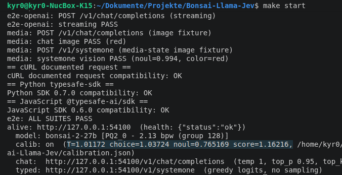
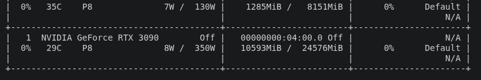
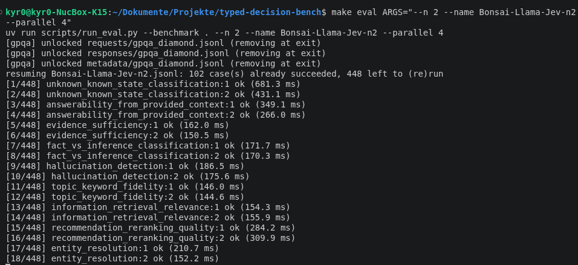

# 🌳🦙 Bonsai-Llama-Jev

🏆 As of 2026-09-22, the best open typed decision model (Jev-like) in [typed-decision-bench](https://kyr0.github.io/typed-decision-bench/) ([GitHub Repo](https://github.com/kyr0/typed-decision-bench)) with Pareto-optimal VRAM requirements (<= 10 GB) and latency.

🏆 First typed decision model to reach **76.46% accuracy** vs. **88% Jev-1.13** and **13% calibration error** vs. **8,4% Jev-1.13** also thanks to post-hoc calibration based on 20% held-out calibration  data in `typed-decision-bench` via my new method: [Qtype-stratified temperature scaling](https://kyr0.github.io/typed-decision-bench/paper/#2-why-typed-decisions-need-calibration).

🏆 First typed decision inference with [🖼️ multimodal/image support](https://github.com/kyr0/Bonsai-Llama-Jev/blob/prism/e2e/media.sh#L61).

## ✨ What it can do

- 💡 **Typed decisions** - send structured `choice`, `noul`, and `score` questions to `/v1/systemone`.
- 🌡️ **Deployment-specific post-hoc calibration** - the bundled Bonsai-2-27B configuration can load the committed `calibration.json`; the exact evidence and scope are documented below.
- 💬 **OpenAI-compatible chat** - `/v1/chat/completions` supports the subset exercised by this repository's end-to-end tests, including non-streaming and streaming chat.
- 🖼️ **Image input** - image requests are exercised end to end for both chat and System One paths.
- 🧠 **Reasoning-capable chat path** - the underlying model/server can use reasoning features through the OpenAI-compatible endpoint when enabled.
- 🛠️ **Tool calling** - supported through the OpenAI-compatible chat path where the underlying llama.cpp/template support applies.
- 🔌 **Tested TypeSafe SDK compatibility** - the repository's E2E suite currently passes with `typesafe-sdk` 0.7.0 and `@typesafe-ai/sdk` 0.6.0. This establishes compatibility for the exercised API surface, not every possible Jev/TypeSafe behavior.
- 🏠 **Local inference** - after model/setup downloads, inference can run entirely on your machine; requests stay local unless you explicitly configure external services.
- 🏎️ **Measured chat throughput** - the README records 143 generated tokens/s on an NVIDIA GeForce RTX 5090 and 46.8 tokens/s on an M5 Max for the referenced chat setup. Throughput depends on hardware, context, backend, quantization, and workload.
- 🧩 **Compact reference deployment** - the documented configuration uses about 10 GB VRAM including weights, image projector, KV cache, and compute buffers, so it fits on a 12 GB-class GPU in that configuration.
- 🏆 **Benchmark-backed quality claims only** - see the linked benchmark for the exact evaluated tasks and configuration rather than treating one percentage as a universal model-quality score.



## 📰 News 

2026-09-22 - [Paper on the method rendered](https://kyr0.github.io/Bonsai-Llama-Jev/).

## 💧 What it consumes

Measured:

| | | |
| --- | --- | --- |
| 🎮 GPU memory | ~10 GB | weights 7 GB + image projector (mmproj) 0.6 GB + KV cache/compute (at 64k context window) ≈ 2.3 GB |
| 💽 Disk | ~20 GB | model files ~17 GB (you only need 3 of the 4 GGUFs), code + build ~1.6 GB |

The documented reference configuration fits on a 12 GB-class GPU. Actual memory use depends on context size, parallel slots, image projector, backend, and other server settings. CPU inference is also supported, with substantially lower throughput.



## 🏆 But is it actually GOOD?

Bonsai is better than all of these models in `accuracy` **and** `calibration` [see benchmark](https://kyr0.github.io/typed-decision-bench/).

| Compared with |  Acc. in Bench |   🌳🦙 Gain (pp) | 🌳🦙 Relative improvement (%) |
| ------------- | -----: | ------------: | -------------------: |
| `laya`        | 46.70% | **+29.76 pp** | **+63.73%** |
| `von-1.1`     | 48.57% | **+27.89 pp** | **+57.42%** |
| `spark-X2.5`  | 70.97% |  **+5.49 pp** | **+7.74%** |
| `openjev-qwen3.5-4b` | 74.13% |  **+2.33 pp** | **+3.14%** |

You can run the `typed-decision-bench` youself!



## 🏎️ And is it really FAST?

p50/p95 latency per decision request and VRAM at 8k KV, same measurement as above:

| Model | p50 Latency (ms) | p95 Latency (ms) | VRAM (8k KV) |
| --- | ---: | ---: | --- |
| laya | 36.7 | 44.4 | 1426 MB @ FP32 |
| von-1.1 | 38.5 | 46.5 | 3888 MB @ FP32 |
| kyr0/bonsai-2-27b-calibration-init | 165.0 | 362.0 | 9242 MB @ Q2_64 |
| **kyr0/bonsai-2-27b-calibrated** | **170.9** | **448.0** | **9242 MB @ Q2_64** |
| jev-1.13.0 | 716.4 | 778.8 | - |
| kyr0/spark-X2.5 | 1,056.6 | 1,783.5 | 9813 MB @ BF16 |
| openjev-qwen3.5-4b | 1,066.1 | 1,478.9 | 12866 MB @ BF16 |

On an RTX 3090, 4 typed decision requests in parallel, are perfectly fine.

## 🚀 Run it

You need: a Linux or Mac machine, an NVIDIA GPU (recommended), about 20 GB of free disk.

**Step 1 - install everything** (builds the server, downloads the model):
```sh
make setup
```
**Step 2 - start it:**
```sh
make start
```
That's it. The server runs in the background at `http://localhost:54100`.

`make start` also runs a few self-checks and prints PASS for each one.

## 🗨️ First message
The 27B is a thinking model, so a plain chat request answers with its reasoning in `reasoning_content` first and only then fills `content` - which a small `max_tokens` never reaches. Disable thinking for direct answers:

```sh
curl http://localhost:54100/v1/chat/completions \
  -H "Content-Type: application/json" \
  -d '{"messages": [{"role": "user", "content": "Hello!"}], "max_tokens": 200, "chat_template_kwargs": {"enable_thinking": false}}'
```

The answer is in the JSON under `choices[0].message.content`. With the OpenAI SDK, just point it at the server (key only needed if you set `BONSAI_API_KEY`):

```python
# pip install openai
from openai import OpenAI
client = OpenAI(base_url="http://localhost:54100/v1")
r = client.chat.completions.create(
    model="bonsai-2-27b",  # any name works unless you set BONSAI_ALIAS
    messages=[{"role": "user", "content": "Hello!"}],
    extra_body={"chat_template_kwargs": {"enable_thinking": False}},
)
print(r.choices[0].message.content)
```

Other OpenAI-compatible clients can work when they use the API subset implemented by this server; point them at the local base URL and verify the features you rely on.

## 🧠 Typed questions (`POST /v1/systemone`)

Ask many questions at once and get numbers back:
```sh
curl http://localhost:54100/v1/systemone -H "Content-Type: application/json" -d '{
  "model": "bonsai-2-27b",
  "state": "My payouts have failed for three days, please help today.",
  "questions": {
    "department":  {"type": "choice", "instructions": "Which team handles this?",
                    "criteria": {"billing": "Payments", "technical": "Bugs"}},
    "urgency":     {"type": "noul",   "instructions": "The message is time-sensitive"},
    "frustration": {"type": "score",  "instructions": "How frustrated?",
                    "criteria": ["Calm", "Frustrated", "Furious"]}
  }
}'
```
Answer:
```json
{"answers": {
  "department":  {"choice": "technical", "probabilities": {"billing": 0.07, "technical": 0.93}},
  "urgency":     {"noul": 0.99},
  "frustration": {"score": 1.01, "probabilities": {"0": 0.01, "1": 0.96, "2": 0.03}}
}}
```
`noul` is a yes/no confidence from 0 to 1. `score` is the weighted average of the scale levels.

These numbers are derived directly from the model's answer-label scores rather than generated as free-form text.

Details: [tools/server/SYSTEMONE.md](tools/server/SYSTEMONE.md).

### 🌡️ Calibration

Raw typed-decision probabilities come from the model's label-score distribution. They can be systematically too sharp or too flat even when the winning answer is useful. This deployment supports **post-hoc temperature scaling**:

$$
p'_i=\frac{p_i^{1/T}}{\sum_j p_j^{1/T}}
$$

$T > 1$ flattens a distribution, $T < 1$ sharpens it, and $T = 1$ is the identity. For every finite $T > 0$, the transform preserves the ordering of candidates, so it does not change the argmax of an otherwise identical probability vector.

Schema-v2 artifacts can fit separate temperatures for `choice`, `noul`, and `score`, with the top-level temperature as fallback:
```json
{
  "temperature": 1.0117198103995582,
  "temperatures": {
    "choice": 1.037240362916239,
    "noul": 0.7651686093861797,
    "score": 1.1621583485318587
  }
}
```
The committed `calibration.json` artifact is enabled by default (`BONSAI_CALIBRATION`); set it to `off` or point it at another artifact to change that.
The server validates the artifact and refuses one marked non-deployable or fitted for a different model name. Calibration is applied to the **final composed candidate distribution** before the typed answer fields are derived. Full loader/runtime contract: [tools/server/SYSTEMONE_CALIBRATION.md](tools/server/SYSTEMONE_CALIBRATION.md). Full mathematical and statistical methodology: [typed-decision-bench/CALIBRATION.md](https://github.com/kyr0/typed-decision-bench/blob/main/CALIBRATION.md).

#### Reference experiment: Bonsai-2-27B, 2026-09-22

The committed `calibration.json` was produced by a `typed-decision-bench` run over all 275 suites with `--n 100`: **27,500 requests total**, consisting of **5,499 calibration cases** and **22,001 disjoint held-out test cases**. This is slightly smaller than the repository's full 27,598 stored rows because GPQA Diamond contains 198 rows and `--n 100` caps that suite at 100.

The experiment provides three distinct layers of evidence.

**1. Held-out generalization was observed, not assumed.**

The frozen temperatures were fitted **only** on the 5,499 `calibrate` cases. Applying them offline to the 22,001 `test` cases changed:

| metric | raw test | calibrated test | change |
| --- | ---: | ---: | ---: |
| NLL | 0.438015 | **0.434996** | **-0.69%** |
| Brier | 0.235513 | **0.233939** | **-0.67%** |
| hard accuracy | 0.832962 | 0.832962 | unchanged offline |
| top-label ECE-15 | **0.011998** | 0.014646 | +22.1% |

The two proper full-distribution scores, NLL and Brier, improved on rows that were not used to fit the temperatures. Aggregate ECE-15 did not improve; this is why the calibration methodology treats ECE as a binned top-label diagnostic rather than the sole definition of probabilistic quality.

**2. The independently deployed C++ implementation reproduced the prediction.**

The same frozen artifact was then loaded into the C++ server and the benchmark was rerun. The served calibrated endpoint produced:

| metric | offline calibrated prediction | actual calibrated server | absolute difference |
| --- | ---: | ---: | ---: |
| NLL | 0.4349960051 | 0.4349837998 | $1.22\times10^{-5}$ |
| Brier | 0.2339390976 | 0.2339318835 | $7.21\times10^{-6}$ |
| soft accuracy | 0.7645820850 | 0.7645868428 | $4.76\times10^{-6}$ |
| mean confidence | 0.8319436708 | 0.8319458355 | $2.16\times10^{-6}$ |

The independently executed runtime therefore lands essentially where the offline temperature transform predicted. ECE differs more because fixed-width binning is discontinuous: a tiny probability change can move cases across bin boundaries.

The independently rerun server reported hard accuracy `0.8330076` versus `0.8329621` in the raw reference run - a difference of one held-out test case. Positive temperature scaling cannot change the argmax of an identical probability vector, so this should be interpreted as cross-run numerical variation near a decision boundary, not as an accuracy effect caused by the calibration transform.

**3. The residual temperature fit reached the expected near-identity fixed point.**

After the frozen artifact was already active, fitting another calibration layer on the same calibration partition returned:

$$
T_{\text{choice}}=0.99991057
$$

$$
T_{\text{noul}}=0.99959046
$$

$$
T_{\text{score}}=0.99999629
$$

with pooled $T=0.99987869$. Every qtype is within **0.041% of identity**.

The additional residual fit changed test NLL only from `0.4349837998` to `0.4349823236`, roughly **0.00034%**. For this benchmark/deployment, the first calibration therefore captured essentially all correction available within this temperature family.

Because this residual fit reuses the same benchmark calibration partition, it is an **implementation/fixed-point consistency check**, not a second independent generalization experiment.

#### Why qtype-specific temperatures matter here

The original pooled temperature was close to identity:

$$
T_{\text{global}}=1.01172
$$

while the qtype fits were:

$$
T_{\text{choice}}=1.03724,\qquad
T_{\text{noul}}=0.76517,\qquad
T_{\text{score}}=1.16216.
$$

That is deployment-specific empirical evidence that different typed-decision output families can have opposing calibration errors which partially cancel in a pooled scalar fit.

The strongest effect was `noul`: comparing the raw reference run with the **actually served calibrated endpoint**, held-out NLL improved from `0.277873` to `0.267815` (about **3.62%**), Brier from `0.169659` to `0.165193` (about **2.63%**), and ECE-15 from `0.046100` to `0.026354` (about **42.8%**).

`score`, conversely, improved NLL/Brier while ECE-15 became slightly worse. That is a useful empirical demonstration of why ECE should remain a diagnostic rather than the sole definition of calibration quality.

#### Scope of the claim

The evidence supports this deployment-specific statement:

> **On the held-out `typed-decision-bench` test distribution used in the 2026-09-22 Bonsai-2-27B reference experiment, qtype-stratified temperature scaling fitted only on the calibration split improved full-distribution NLL and Brier score, transferred to the independently rerun calibrated C++ server, and reached the expected near-identity residual-temperature fixed point.**

It does **not** establish that these temperatures are optimal for arbitrary future production distributions, different model weights, different quantization, different prompt templates, different adapters, or materially changed inference paths. If you change those, refit and re-evaluate calibration.

## 🔁 Determinism

`/v1/systemone` performs a direct logits readout and does not sample, so there is no sampling seed on this path. That does **not** imply bit-identical results under every hardware/backend/concurrency condition.

In a 10-repeat measurement on the reference server:

| mode | observed maximum probability spread |
| --- | ---: |
| sequential, otherwise idle server | **0.0** in that test |
| concurrent with other requests | up to **~1e-2** in that test |

The concurrent variation is consistent with batch-composition-dependent floating-point differences in the batched prefill path. The measurement does not establish a universal `1e-2` bound for every GPU, backend, driver, model, context, or batch shape.

Practical consequences:

- Compare `score`, `noul`, and probability vectors with an explicit numerical tolerance when running concurrently.
- A `choice` can change only when numerical variation changes the ordering of the top candidates; in the observed setup this is relevant primarily near small top-2 margins. Do not treat a fixed margin such as `2e-2` as a universal safety guarantee.
- For the strongest reproducibility in the **currently tested configuration**, run benchmark requests sequentially (`--parallel 1`). The 10-repeat sequential test was bit-identical, but that is an empirical result for that setup rather than a cross-platform theorem.

Chat completions are different because they normally sample. A fixed `seed` can reduce sampling variability, but exact reproducibility can still depend on backend numerics, concurrency, hardware, and implementation details.

## 🖼️ Send an image

Same chat endpoint - put an image into the message:
```json
{"role": "user", "content": [
  {"type": "text", "text": "What is in this picture?"},
  {"type": "image_url", "image_url": {"url": "data:image/png;base64,...."}}
]}
```
Works for `/v1/systemone` too - the state becomes an object with a `content` array instead of a

plain string (checked end to end by `make e2e-jev`):
```sh
curl http://localhost:54100/v1/systemone -H "Content-Type: application/json" -d '{
  "model": "bonsai-2-27b",
  "state": {
    "ticket": "color-check",
    "content": [
      {"type": "text", "text": "What color is the square?"},
      {"type": "image_url", "image_url": {"url": "data:image/png;base64,...."}}
    ]
  },
  "questions": {
    "is_red": {"type": "noul", "instructions": "The dominant shape in the image is red"},
    "color":  {"type": "choice", "instructions": "Primary color of the shape",
               "criteria": {"red": "red", "blue": "blue", "green": "green"}}
  }
}'
```
```json
{"answers": {
  "is_red": {"noul": 0.98},
  "color":  {"choice": "red", "probabilities": {"red": 0.97, "blue": 0.02, "green": 0.01}}
}}
```
Image tokens count toward `usage.input_tokens` like any other input.

## 🔌 From code (SDKs)

The typed endpoint implements the TypeSafe/System One wire shape exercised by this repository. The following official SDK versions are covered by the current E2E tests:

```python
# pip install typesafe-sdk
from typesafe_sdk import Choice, Noul, TypeSafeClient
with TypeSafeClient(base_url="http://localhost:54100") as client:  # + api_key if you set one
    r = client.system_one(
        state="My payouts have failed for three days, please help today.",
        questions={
            "department": Choice(instructions="Which team?", criteria={"billing": "Payments", "technical": "Bugs"}),
            "urgency": Noul(instructions="The message is time-sensitive"),
        },
    )
print(r.choices["department"].choice, r.nouls["urgency"].noul)  # technical 0.99
```

```js
// npm i @typesafe-ai/sdk
import { TypeSafeClient, choice } from "@typesafe-ai/sdk";
const client = new TypeSafeClient({ baseURL: "http://localhost:54100" });
const r = await client.systemOne({
  state: "I was charged twice. Please fix this ASAP.",
  questions: { tone: choice("Customer tone?", { calm: null, angry: null }) },
});
console.log(r.answers.tone.choice);
```

Both paths are exercised by `make e2e`. Passing those tests establishes compatibility with the exercised SDK/API surface; it is not a claim that every current or future Jev/TypeSafe feature is implemented.

## 🎛️ Commands

| Command | What it does |
| --- | --- |
| `make setup` | Install + build + download the model (first time only) |
| `make start` | Start the server in the background, run the self-checks once |
| `make stop` | Stop it |
| `make status` | Is it alive - model, calibration on/off, both endpoint URLs (`/v1/chat/completions`, `/v1/systemone`) |
| `make logs` | Watch the server log (Ctrl-C to stop watching) |
| `make e2e` | Full self-check: OpenAI chat, streaming, images, both SDKs |
| `make e2e-openai` / `make e2e-jev` | Just one part of the checks |
| `make configure-h200` | Pick your GPU (also `-rtx-pro-6000-ada`, `-rtx-5050`, `-rtx-3090`, or plain `-cuda`), then `make build` |
| `make llama-server ARGS="..."` | Run the server binary yourself with your own flags |

## ⚙️ Settings

Copy `.env.example` to `.env`, then edit. The ones you might need:

- `PORT` - which port (default 54100)

- `BONSAI_API_KEY` - require this password; empty = no password

- `BONSAI_ALIAS` - model name shown in `/v1/models`

- `BONSAI_MAX_TOKENS` - hard ceiling on generated tokens per request

- `BONSAI_CTX` - context size (0 = auto)

- `BONSAI_NP` - parallel slots (default 4; 8 or 20 for concurrent /v1/systemone load - note llama.cpp

  splits `BONSAI_CTX` per slot, so raise it too: `BONSAI_CTX=262144` gives 20 slots × 13312 tokens)

- `BONSAI_NGL` - GPU layers: `99` = everything (default), `0` = CPU only

- `BONSAI_CALIBRATION` - path to a deployable typed-decision calibration artifact (default: the committed `calibration.json`; `off` = uncalibrated probabilities)
- `BONSAI_GGUF` - serve a different GGUF file instead

- `BONSAI_MMPROJ` - image projector that belongs to it

- `CUDA_VISIBLE_DEVICES` - which GPU, e.g. `1`

## ❓ Something wrong?

- Server not answering? → `make status`, then `make logs`.
- Out of GPU memory? → reduce GPU layers with `BONSAI_NGL`, reduce context/parallelism, or inspect the actual allocation before assuming the reference ~10 GB figure applies to your configuration.
- `/v1/systemone` timing out under load? → rising latency usually means the available slots/GPU are saturated. Try fewer client workers, more slots where memory permits, or multiple physical devices.
- Slow even when idle? → System One work grows with prompt size and answer-label readouts. In the documented reference measurements, cross-request `--cache-reuse 256` did not materially improve one tested workload (`12.6s` vs `12.5s`), so shorten the state/question fan-out before assuming cache reuse will help.
- Two benchmark runs gave slightly different probabilities? → see [Determinism](#-determinism). In the documented 10-repeat measurement, sequential requests were bit-identical while concurrent requests showed up to ~`1e-2` probability spread. Those are measurements for that setup, not universal bounds.
- "But my GPU is stronger than this!" → in the documented reference measurements, one large request reached ~100% GPU utilization at ~350 W and the ternary Q2_64 prefill path behaved compute-bound around ~3k tok/s. Changing `-b/-ub` through the tested range and enabling cross-request cache reuse did not materially improve that workload; a second process on the same GPU was slower because of contention. A second physical GPU is one tested way to scale independent requests, but do not assume perfectly linear scaling on different hardware or workloads.
- Want a different model? → set `BONSAI_GGUF=/path/to/model.gguf`. If you change the model or materially change the inference configuration, refit and re-evaluate the calibration artifact rather than reusing the bundled temperatures unchanged.

## Citation

If you use the Bonsai-Llama-Jev inference engine, its method for turning causal language models into a typed-decision engine or its Qtype-stratified temperature scaling method, please cite my work (see [CITATION.cff](CITATION.cff)):

```bibtex
@software{homberg2026bonsaillamajev,
  author    = {Homberg, Aron},
  title     = {Turning Causal Language Models Into Typed-Decision Engines},
  year      = {2026},
  version   = {5},
  publisher = {GitHub},
  url       = {https://github.com/kyr0/Bonsai-Llama-Jev},
  license   = {MIT}
}
```

## License

MIT license. The underlying engine is [llama.cpp](https://github.com/ggml-org/llama.cpp);

its [docs folder](docs/) has everything else.